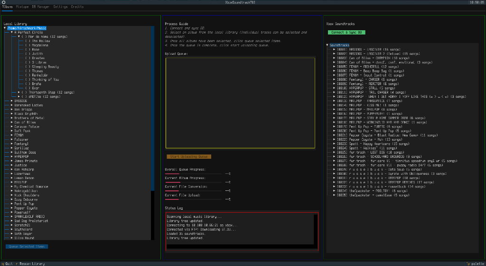
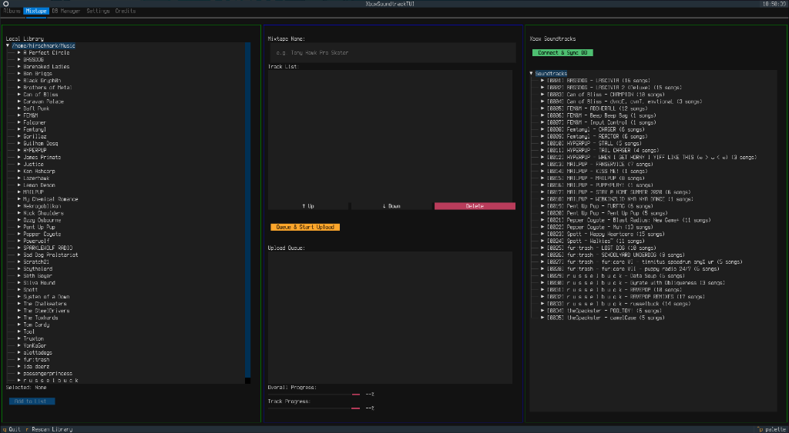
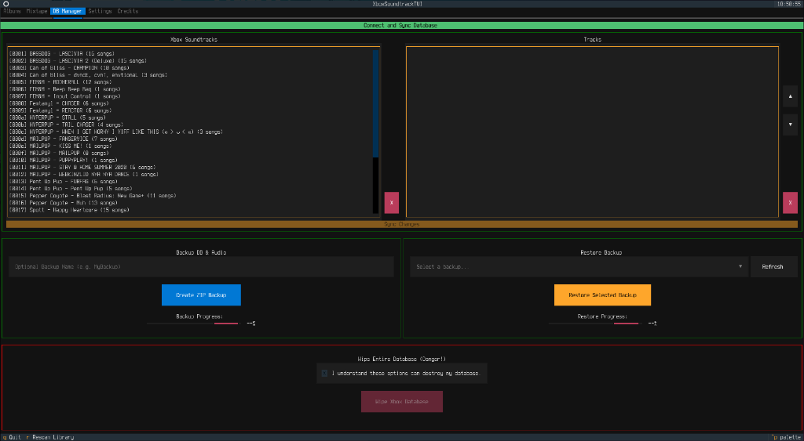
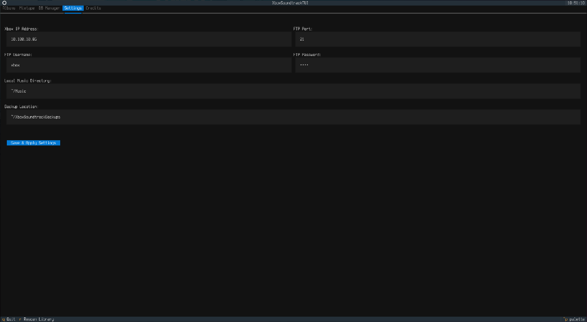

# Xbox Soundtrack TUI

A full-featured Terminal User Interface (TUI) for managing, converting, and syncing custom soundtracks on the original Microsoft Xbox. 

This project allows you to natively manage your original Xbox custom soundtracks directly from Linux (or any Python-capable OS). It completely bypasses the need for old, clunky Windows XP-era tools by reverse-engineering the Xbox's internal `ST.DB` database structure and managing everything over the network via FTP.



## Features

- **Direct FTP Syncing**: Connects directly to your original Xbox over FTP. No need to physically remove the hard drive or use aging Windows software.
- **Automated WMA Conversion**: Automatically parses your local music library (using `tinytag`) and converts it to the exact audio specification the original Xbox demands (16-bit, 44.1kHz, Stereo WMA) using `ffmpeg`.
- **ST.DB Reverse-Engineering**: Dynamically downloads, parses, modifies, and uploads the proprietary `ST.DB` binary database that the Xbox dashboard uses to track music.
- **Ghost Deduplication**: Intelligently cleans up "ghost" tracks and orphaned folders left behind by the Xbox's native (and somewhat buggy) dashboard deletion mechanic.
- **Database Backup & Restore**: Instantly backup your Xbox's music database before making changes, and restore it with a single click if something goes wrong.
- **Terminal UI**: Built entirely in the terminal using the `Textual` framework, offering a fast, mouse-supported, responsive UI.

---

## Screenshots

### Main Interface

*Select local albums, choose individual tracks, and queue them up for syncing.*

### Mixtape Builder

*Create completely custom soundtracks by mixing and matching tracks from different albums.*

### Database Manager

*Backup your Xbox database, safely wipe old soundtracks, or restore previous backups with a single click.*

### Settings

*Configure your Xbox FTP connection credentials and local paths.*

---

## Installation

You have two options for running the Xbox Soundtrack TUI: running the pre-compiled standalone binary (easiest for Linux), or running it directly from the Python source code.

### Option 1: Standalone Linux Binary
If you are using Linux, you can run the pre-compiled binary without needing to configure Python or virtual environments.

1. Download the `xbox_soundtrack_tui` executable from the Releases page.
2. Ensure you have `ffmpeg` installed on your system (the app uses it under the hood for audio conversion):
   ```bash
   sudo apt install ffmpeg   # Debian/Ubuntu
   sudo pacman -S ffmpeg     # Arch Linux
   sudo dnf install ffmpeg   # Fedora
   ```
3. Make the file executable and run it:
   ```bash
   chmod +x xbox_soundtrack_tui
   ./xbox_soundtrack_tui
   ```

### Option 2: Running from Source (Windows / macOS / Linux)
The Python source code is entirely cross-platform and fully compatible with Windows. However, as I do not have a Windows machine, I am unable to test it natively or compile a standalone `.exe` release. Windows users can easily run the application directly from the source code, or submit a pull request with a compiled executable!

**Prerequisites:**

- Python 3.10+
- `ffmpeg` installed and available in your system's PATH.

**Setup:**
1. Clone the repository:
   ```bash
   git clone https://github.com/yourusername/XBOXSoundtrackTUI.git
   cd XBOXSoundtrackTUI
   ```
2. Create and activate a virtual environment:
   ```bash
   python3 -m venv venv
   source venv/bin/activate  # On Windows: venv\Scripts\activate
   ```
3. Install the dependencies:
   ```bash
   pip install -r requirements.txt
   ```
4. Run the application:
   ```bash
   python3 app.py
   ```

---

## Usage

1. **Configuration**: Open the **Settings** tab. Enter your Xbox's IP address (default Port 21, `xbox`/`xbox` for credentials). Set your local music directory and backup location. Click "Save & Apply".
2. **Connect**: Head over to the **DB Manager** tab and click "Connect and Sync Database". This downloads your current `ST.DB` from the Xbox.
3. **Queueing Music**: On the **Albums** tab, select the local albums/tracks you wish to send to the Xbox and click "Queue Selected Items".
4. **Syncing**: Once queued, click "Start Uploading Queue". The application will automatically convert the files to WMA, generate the correct Xbox header metadata, upload the audio files via FTP, and inject the new entries into your `ST.DB`.

## Credits & Acknowledgements

*This application was coded by Gemini on Antigravity with the guidance of a human.*

> *"I needed an app that would actually work on linux to make/transfer/manage soundtracks on my orginal xbox and didn't have the skill to do it myself. I provide this tool to the community as is with the hope it could be ported or remade for all systems"* - Hirschmark

**Core Dependencies:**
- **Textual**: Terminal user interface framework
- **TinyTag**: Audio metadata and duration extraction
- **FFmpeg**: Audio conversion and resampling
- **Python Standard Library**: FTPlib, Struct, OS

**Special Thanks & References:**
- **XboxDevWiki & Community**: Reference material for Xbox file formats.
- **ST.DB Parser**: The internal `ST.DB` database structure was reverse-engineered from scratch via hex-editing.
